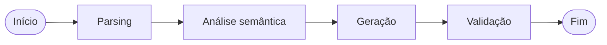

# Pipeline Híbrido — Modernização SQL → Python

Pipeline híbrido (LLM + regras determinísticas) para modernização de stored procedures **PL/pgSQL** em módulos **Python 3.12+** (compatível com 3.14), orquestrado com **LangGraph** e exposto via API local (`langgraph dev`).

> Referência: [`Desafio_Tecnico_Inovacao_v2_candidatos.pdf`](Desafio_Tecnico_Inovacao_v2_candidatos.pdf)

## Visão geral

O fluxo recebe o SQL de uma procedure/função (e opcionalmente o schema do Anexo A), executa quatro etapas em grafo e devolve código Python + relatório JSON:

1. **Parsing** — IR estruturada (`sqlglot` + `sqlparse` + heurísticas PL/pgSQL)
2. **Análise semântica** — features, riscos e estratégia de delegação SQL/Python
3. **Geração** — LLM (se `OPENAI_API_KEY`) ou templates determinísticos por procedure conhecida
4. **Validação** — `ast.parse` + lint leve; persiste em PostgreSQL



## Execução com [uv](https://docs.astral.sh/uv/)

```bash
git clone <url-do-repositorio>
cd technical-challenge-hybrid-pipeline

uv sync

docker compose up -d
uv run python scripts/init_db.py

uv run langgraph dev --no-browser
```

### Endpoints

| Método | Rota | Descrição |
|--------|------|-----------|
| `GET` | `/health` | `{"status": "ok", "database": "ok\|unavailable"}` |
| `POST` | `/modernize` | Body: `{ "source_code": "...", "schema_context": "..." }` |
| `GET` | `/metrics/evaluation` | Roda métrica nos fixtures B–F (requer Postgres) |

```bash
curl http://localhost:2024/health

curl -X POST http://localhost:2024/modernize \
  -H "Content-Type: application/json" \
  -d "{\"source_code\": \"$(cat fixtures/annex_b_fn_saldo_cliente.sql | jq -Rs .)\"}"
```

Gerar artefatos locais (sem servidor):

```bash
uv run python scripts/run_fixtures.py   # grava outputs/*.py e *_report.json
uv run pytest
uv run ruff check .
```

### Variáveis de ambiente

Copie `.env.example` → `.env`:

| Variável | Uso |
|----------|-----|
| `DATABASE_URL` | PostgreSQL (`modernization_history`) |
| `OPENAI_API_KEY` | Geração via LLM (opcional; sem chave usa templates) |
| `OPENAI_MODEL` | Modelo OpenAI (padrão: `gpt-4o-mini`) |

## Estrutura do projeto

```
src/hybrid_pipeline/
  api/app.py           # FastAPI (/health, /modernize, /metrics)
  graph/               # LangGraph: estado + nós + build.py
  pipeline/            # parsing, analysis, generation, validation
  persistence/         # PostgreSQL
  metrics/             # evaluation (ast_parse_rate)
fixtures/              # Anexos A–F
outputs/               # Resultados B–F (gerados)
scripts/               # init_db.py, run_fixtures.py
tests/
```

## Bibliotecas e justificativas

| Biblioteca | Papel |
|------------|--------|
| **sqlglot** | AST SQL portável para statements DML/SELECT dentro do corpo PL/pgSQL |
| **sqlparse** | Tokenização e classificação lexical complementar |
| **LangGraph** | Orquestração tipada em grafo (requisito do desafio) |
| **langchain-openai** | Geração LLM com prompt enriquecido (parse + análise + schema) |
| **psycopg3** | Persistência e código gerado alinhado ao driver moderno |
| **FastAPI** | Rotas customizadas integradas ao `langgraph dev` via `langgraph.json` |

## Decisões técnicas

| Tema | Decisão | Trade-offs |
|------|---------|------------|
| Parser SQL | sqlglot + sqlparse + regex PL/pgSQL | Não cobre 100% da gramática PL/pgSQL; suficiente para o escopo do desafio |
| Geração | Híbrido: templates para Anexos B–F; LLM se houver API key | Templates garantem reprodutibilidade offline; LLM generaliza procedures novas |
| SQL no SGBD vs Python | CTE recursiva/RETURN QUERY permanecem SQL; cursor (E) vira bulk fetch | Menos risco semântico em SQL complexo; mais lógica Python em validações simples |
| Cursores (Anexo E) | `fetchall` + loop em memória em vez de FETCH incremental | Evita N+1 de round-trips mantendo semântica |
| CTE / SETOF (Anexo F) | SQL parametrizado + fallback em `except` | Alinha com `RAISE WARNING` + linha degradada da procedure original |
| Persistência | Toda execução em `modernization_history` | Falha de DB não interrompe resposta (timeout 2s) |

## Métrica de evaluation (Bônus 3)

- **Métrica:** `ast_parse_rate` — fração do código gerado que passa em `ast.parse` (1.0 = sucesso sintático).
- **Captura:** sintaxe Python válida; **não captura:** equivalência comportamental com o banco.
- **Onde:** tabela `migration_metrics` + endpoint `GET /metrics/evaluation`.
- **Evolução em produção:** adicionar testes golden no Postgres de teste e diff de resultados.

## Escalabilidade (proposta)

- Fila (Redis/RQ) para `/modernize` assíncrono em alto volume
- Cache de parse/análise por hash do `source_code`
- Registry de dialetos (`postgres`, `tsql`) plugável nos nós
- Pool de conexões psycopg e read replicas para histórico

## Limitações conhecidas

- Parser PL/pgSQL é heurístico, não um compilador completo.
- Procedures fora dos Anexos B–F sem LLM retornam `NotImplementedError` no template genérico.
- Equivalência comportamental não é validada automaticamente (apenas estática).
- Langfuse não integrado nesta versão (estrutura preparada via `Settings.langfuse_*`).

## Com mais tempo

- Langfuse self-hosted no `docker-compose` com spans por nó
- Testes de regressão executando procedures no Postgres de teste
- Suporte a `mypy` no código gerado
- UI para revisão humana do diff SQL/Python

---

## Checklist — Instruções gerais e README

- [x] Entrega em repositório Git
- [x] README com descrição da pipeline e fluxo
- [x] README com passos locais (Docker + uv + langgraph)
- [x] README com decisões técnicas e trade-offs
- [x] README com limitações e evoluções futuras
- [x] Bibliotecas externas justificadas
- [x] Uso de IA documentado (LLM opcional + templates)

## Checklist — Pipeline híbrida

### Parsing
- [x] Receber código SQL
- [x] Representação estruturada (IR + sqlglot por statement)
- [x] Biblioteca justificada (sqlglot + sqlparse)

### Análise semântica
- [x] IN/OUT, variáveis, cursores, transações, exceções, CTEs, chamadas
- [x] Pontos de risco marcados

### Geração
- [x] Python equivalente
- [x] LLM com contexto das etapas anteriores
- [x] Decisão SQL vs Python documentada

### Validação
- [x] `ast.parse`
- [x] Lint leve
- [ ] Comparação comportamental no banco (evolução)

### LangGraph
- [x] Grafo parsing → análise → geração → validação
- [x] Estado tipado (`PipelineState`)
- [x] Diagrama no README

## Checklist — Requisitos obrigatórios

### API
- [x] `langgraph dev`
- [x] `POST /modernize`
- [x] `GET /health`
- [x] Separação api / graph / pipeline / persistence

### PostgreSQL
- [x] Docker Compose PostgreSQL
- [x] Tabela `modernization_history` (todos os campos)
- [x] Persistência em toda execução (quando DB disponível)
- [x] Scripts `scripts/init_db.sql` + `init_db.py`

### Escalabilidade
- [x] Proposta documentada

## Checklist — Entrega

- [x] Código modular em `src/hybrid_pipeline`
- [x] `docker-compose.yml`
- [x] Resultados B–F em `outputs/`
- [x] Variáveis de ambiente documentadas

## Checklist — Anexos

- [x] Schema Anexo A como contexto opcional

| Anexo | Procedure | Contemplado |
|-------|-----------|-------------|
| B | `fn_saldo_cliente` | [x] |
| C | `sp_atualizar_status_contas_inativas` | [x] |
| D | `sp_transferir_entre_contas` | [x] |
| E | `sp_processar_lote_taxas` | [x] |
| F | `sp_relatorio_mensal_cliente` | [x] |

- [x] **B** — escalar, agregação
- [x] **C** — IN/OUT, UPDATE, GET DIAGNOSTICS, RAISE
- [x] **D** — transação, FOR UPDATE, EXCEPTION
- [x] **E** — cursor → bulk, CASE, JSONB
- [x] **F** — CTE recursiva, função aninhada, RETURN QUERY, fallback

## Checklist — Bônus

### Observabilidade (Langfuse)
- [ ] Integração Langfuse
- [ ] Captura de tela no README

### QA
- [x] Ruff
- [x] pytest (`uv run pytest`)

### Métrica evaluation
- [x] `ast_parse_rate` implementada
- [x] Tabela `migration_metrics` + endpoint `/metrics/evaluation`
- [x] Justificativa documentada

## Critérios de avaliação

| Critério | Contemplado |
|----------|-------------|
| Funcionamento geral | [x] |
| Código e estrutura | [x] |
| Arquitetura LangGraph | [x] |
| Banco de dados | [x] |
| Escalabilidade | [x] |
| Documentação | [x] |
| Bônus (métrica + QA) | [x] parcial |

---

Boa prova!
